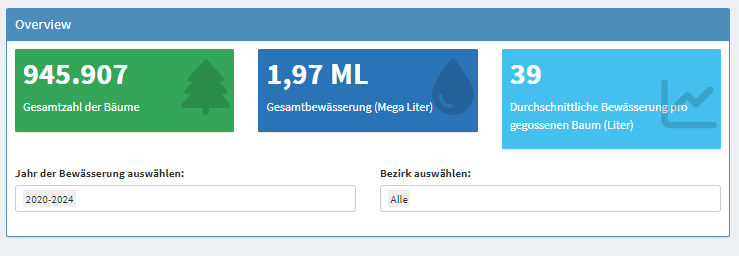

(landing-page)=
# Eine Startseite für das Dashboard gestalten
```{admonition} Story
:class: story
Amir möchte sich zunächst einen schnellen Überblick verschaffen: Wie werden Bäume in Berlin gegossen, und wie engagieren sich die Bürger:innen dabei? Bei seiner Recherche stößt er auf die Plattform *Gieß den Kiez*. Besonders beeindruckt ihn, wie anschaulich die Daten dort visualisiert sind – das möchte er für seine eigene R-Shiny-Anwendung übernehmen.
```

```{admonition} Zweck dieser Übung 
:class: lernziele

- Der Aufbau eines Dashboards als Form der Visualisierung in der Verwaltungswissenschaft umfasst die Gestaltung einer übersichtlichen Startseite für ein R-Shiny-Dashboard. Diese soll zentrale Informationen klar strukturiert darstellen, den Nutzer:innen einen schnellen Überblick verschaffen und gleichzeitig als intuitiver Einstiegspunkt in die Anwendung dienen.

```

Die **Startseite** seines Dashboards soll als zentrale Übersicht und Einstiegspunkt dienen. Hier werden die wichtigsten Kennzahlen sofort sichtbar:

- **Gesamtanzahl der Bäume**
- **Anzahl gegossener Bäume**
- **Verbrauchte Wassermenge**

Damit liefert die Startseite einen kompakten, aber aussagekräftigen Überblick über das Engagement der Bürger:innen. Sie beantwortet bereits auf den ersten Blick zentrale Fragen der Analyse:

**1. Wie groß ist der Gesamtbestand an Bäumen?**
**2. Wie viele davon wurden aktiv bewässert?**

So ist die Startseite nicht nur auf erstem Blick intuitiv und verständlich, sondern auch funktional der ideale Ausgangspunkt für die weitere Erkundung der Daten.

Für den Einstieg arbeitet Amir mit dem Datensatz *„Gieß den Kiez – Bewässerungsdaten“* von **GovData**. Dieser Datensatz bietet detaillierte Informationen darüber, wann, wo und wie viel gegossen wurde. Er eignet sich ideal, um erste Analysen zum Gießverhalten zu erstellen, da er sowohl zeitliche als auch räumliche Bezüge enthält und öffentlich zugänglich ist.


*Abbildung 1: Startseite des Dashboards (Quelle: eigene Ausarbeitung)*

Für die Startseite seiner Anwendung entscheidet sich Amir für eine **kompakte Kennzahlenübersicht**. Diese soll den Nutzer:innen helfen, sofort die Größenordnung des Gießverhaltens einzuschätzen – etwa, wie viele Bäume gegossen wurden, wie oft und mit welchem Wasservolumen.

Zusätzlich plant er **Filtermöglichkeiten** nach **Bezirk** und **Jahr**, um die Kennzahlen gezielt einzugrenzen und Entwicklungen über die Zeit oder regionale Unterschiede sichtbar zu machen. Damit lassen sich die Daten auch in einer feineren Granularität betrachten – von stadtweiter Übersicht bis hin zu einzelnen Bezirken und spezifischen Jahren.

Als Nächstes bauen wir die Startseite des Dashboards mit R. Nach jedem Codeabschnitt werden kurz die verwendeten Techniken und Befehle erklärt. Wir widmen uns sowohl der Benutzeroberfläche (UI) als auch der Serverseite des R-Shiny-Dashboards.

## Benutzeroberfläche (UI)
Amir entscheidet sich für ein System der Benutzeroberfläche, die aus zwei Teilen besteht:

- einer Seitenleiste (``sidebarMenu``) mit der Navigation

- einem Inhaltsbereich (``tabItem``) mit:

    - ValueBoxen für wichtige Kennzahlen

    - Dropdowns zur Auswahl des Zeitraums und des Bezirks

Somit lässt sich eine übersichtliche Navigationsstruktur etablieren. 

**Navigation: sidebarMenu**

```bash
dashboardSidebar(
  sidebarMenu(
    menuItem("Startseite", tabName = "start", icon = icon("home"))
  )
)
```
```{admonition} Merke: 
:class: keypoint 

``menuItem(...)`` definiert einzelne Seiten im Dashboard – über tabName verknüpft mit dem jeweiligen Inhaltsbereich.
```

- ``sidebarMenu(...)`` ist die Hauptnavigation des Dashboards.
- ``menuItem(...)`` erzeugt einen Menüpunkt:
- ``"Startseite"`` ist der angezeigte Name.
- ``tabName = "start"`` verbindet den Menüpunkt mit dem Tab.
- ``icon("home")`` zeigt ein kleines Symbol an.

**Inhalt: tabItem mit Übersichtsbox**

```bash
tabItems(
  tabItem(tabName = "start",
    box(title = "Overview", status = "primary", solidHeader = TRUE, width = 12,
      fluidRow(
        uiOutput("dynamic_tree_box"),
        valueBoxOutput("total_water"),
        valueBoxOutput("avg_water")
      ),
      fluidRow(
        column(width = 6,
          selectInput("start_year", "Jahr der Bewässerung auswählen:",
            choices = c("2020-2024", "Baumbestand Stand 2025", sort(unique(na.omit(year(df_merged_clean$timestamp))))),
            selected = "Baumbestand Stand 2025",
            multiple = TRUE
          )
        ),
        column(width = 6,
          selectInput("bezirk", "Bezirk auswählen:",
            choices = c("Alle", unique(df_merged_clean$bezirk)),
            selected = "Alle",
            multiple = TRUE
          )
        )
      )
    )
  )
)
```
```{admonition} Merke: 
:class: keypoint 

``fluidRow()`` ordnet Inhalte nebeneinander. ``box(...)`` gruppiert UI-Elemente visuell und funktional.
```

```{admonition} Beispiel: 
:class: tip
In einer ``fluidRow`` können drei ``valueBoxOutput(...)``-Elemente nebeneinander angezeigt werden.
```

**Erklärung der Elemente:**
- ``box(...)`` ist ein Container mit:
    - ``title`` (Überschrift)
    - ``status = "primary"`` (Farbe)
    - ``solidHeader = TRUE`` (fester Rand)
    - ``width = 12`` (volle Breite – 12 ist die maximale Spaltenanzahl)
- ``fluidRow(...)`` sorgt für eine horizontale Anordnung (z. B. nebeneinander statt untereinander).
- ``uiOutput(...)`` ist ein dynamischer Platzhalter für Inhalte, die später im Server je nach Auswahl angezeigt werden.
- ``valueBoxOutput(...)`` reserviert Platz für eine Box mit Kennzahlen.

**Filter-Menüs mit ``selectInput``**

```bash
selectInput("start_year", ...)
selectInput("bezirk", ...)
```
**Erläuterung der einzelnen Teile:**
- ``selectInput(...)`` erstellt ein Dropdown-Menü (also eine Auswahlliste).
- ``"bezirk"`` ist der Name, unter dem Shiny diesen Input später erkennt → input$bezirk
- ``"Bezirk auswählen:"`` ist der Text, der über dem Menü steht.
- ``choices = c("Alle", unique(df$bezirk))``
- ``df$bezirk`` heißt: Aus der Tabelle df nimm die Spalte bezirk.
- ``unique(df$bezirk)`` bedeutet: Nur jeden Bezirk einmal anzeigen – keine Dopplungen.
- ``c(...)`` macht daraus eine Liste aller Bezirke plus **“Alle”**.
- ``multiple = TRUE`` heißt: Man darf mehrere Bezirke gleichzeitig auswählen.

```{admonition} Merke: 
:class: keypoint 

Mit ``multiple = TRUE`` können mehrere Jahre oder Bezirke gleichzeitig ausgewählt werden. Diese Auswahl steht im Server unter ``input$start_year`` und ``input$bezirk`` zur Verfügung.
```


- ``selectInput(...)`` erstellt ein Dropdown-Menü.
- ``multiple = TRUE`` bedeutet, dass man mehrere Werte gleichzeitig auswählen kann.
- Die gewählten Werte sind später über ``input$start_year`` bzw. ``input$bezirk`` im Server verfügbar.

## Server

```bash
filteredData <- reactive({
  req(input$stats_baumvt_year)
  
  df <- df_merged %>%
    mutate(year = lubridate::year(timestamp))
  
  df_filtered <- df %>%
    filter(
      ("Baumbestand Stand 2025" %in% input$start_year & 
       (is.na(timestamp) | year %in% 2020:2024)) |
      ("2020-2024" %in% input$start_year & 
       !is.na(timestamp) & year %in% 2020:2024) |
      (any(!input$start_year %in% c("2020-2024", "Baumbestand Stand 2025")) & 
       year %in% as.numeric(input$start_year))
    )

  if (all(input$start_year == "2020-2024")) {
    df_filtered <- df_filtered %>% filter(!is.na(timestamp))
  }

  if (!is.null(input$bezirk) && input$bezirk != "Alle") {
    df_filtered <- df_filtered %>% filter(bezirk %in% input$bezirk)
  }

  df_filtered
})
```
**Wichtige Begriffe erklärt:**
- ``reactive(...)``: erzeugt eine reaktive Funktion, die automatisch neu berechnet wird, wenn sich Eingaben ändern.
- ``req(...)``: sorgt dafür, dass die Funktion nur ausgeführt wird, wenn bestimmte Eingaben vorhanden sind.
- ``mutate(...)``: erzeugt eine neue Spalte year durch Extraktion aus timestamp.

```{admonition} Merke: 
:class: keypoint 

``reactive()`` ist wie ein **intelligenter Beobachter**: Er reagiert **automatisch** auf Eingaben und aktualisiert die Daten.
```

**if- und else-Anweisungen**
```bash
if (Bedingung) {
  # wird ausgeführt, wenn die Bedingung wahr ist
} else {
  # wird ausgeführt, wenn die Bedingung falsch ist
}
```

Diese Struktur nennt man **Bedingung**. Sie steuert den Ablauf des Codes abhängig von bestimmten Eingaben.

**Operatoren**
- ``%in%``: prüft, ob ein Wert in einer Liste enthalten ist.
- ``<-``: weist einer Variable einen Wert zu (z. B. ``x <- 3``).
- ``|`` = ODER, ``&`` = UND

**Dynamische Anzeige: total_trees oder total_tree_watered**

```bash
output$dynamic_tree_box <- renderUI({
  if ("Baumbestand Stand 2025" %in% input$start_year) {
    valueBoxOutput("total_trees")
  } else {
    valueBoxOutput("total_tree_watered")
  }
})
```
- ``renderUI(...)``: erzeugt dynamische Elemente.
- Abhängig von der Auswahl (``input$start_year``) wird eine andere Kennzahl angezeigt.

```{admonition} Merke: 
:class: keypoint 

``renderUI(...)`` erlaubt es, UI-Elemente zur Laufzeit zu verändern – je nach Nutzereingabe.
```

```{admonition} Beispiel: 
:class: tip
Wird nur „2020–2024“ ausgewählt, zeigt dynamic_tree_box nur gegossene Bäume an.
```

**ValueBoxes**

Alle Bäume

```bash
output$total_trees <- renderValueBox({
  valueBox(
    formatC(n_distinct(df_merged$gisid), format = "d", big.mark = "."),
    "Gesamtzahl der Bäume",
    icon = icon("tree"),
    color = "green"
  )
})
```
- ``output$total_trees`` ist das, was in die Box ``valueBoxOutput("total_trees")`` geschrieben wird.
- ``renderValueBox({...})`` sagt: „Berechne, was in die Box geschrieben wird.“
- ``n_distinct(...)``: zählt eindeutige Werte.
- ``formatC(...)``: formatiert Zahlen, z. B. mit Tausenderpunkten.
- ``icon("tree")`` zeigt ein Baum-Icon.
- ``color = "green"`` färbt die Box grün.

**Gegossene Bäume**
```bash
output$total_tree_watered <- renderValueBox({
  valueBox(
    formatC(n_distinct(filteredData()$gisid), format = "d", big.mark = "."),
    "Gesamtzahl der gegossenen Bäume",
    icon = icon("tree"),
    color = "green"
  )
})
```
- Nur Bäume, die tatsächlich gegossen wurden, werden gezählt – basierend auf ``filteredData()``.

**Durchschnittliche Bewässerung**

```bash
output$avg_water <- renderValueBox({
  valueBox(
    formatC(mean(filteredData()$bewaesserungsmenge_in_liter, na.rm = TRUE), digits = 2),
    "Durchschnittliche Bewässerung pro gegossenen Baum (Liter)",
    icon = icon("chart-line"),
    color = "aqua"
  )
})
```
- ``mean(...)``: berechnet den Durchschnitt.
- ``na.rm = TRUE``: ignoriert fehlende Werte (NA = "Not Available").

**Einheiten clever umrechnen**

```bash
convert_units <- function(liters) {
  if (liters >= 1e6) {
    return(list(value = round(liters / 1e6, 2), unit = "ML"))
  } else if (liters >= 1e3) {
    return(list(value = round(liters / 1e3, 2), unit = "m³"))
  } else {
    return(list(value = round(liters, 2), unit = "L"))
  }
}
```
- ``1e6`` = 1.000.000 Liter
- ``round(...)``: rundet auf 2 Nachkommastellen
- ``switch(...)`` (siehe unten) hilft beim Umwandeln in ausgeschriebene Einheiten:

```bash
full_unit <- function(unit) {
  switch(unit,
    "ML" = "Mega Liter", 
    "m³" = "Kubikmeter", 
    "L" = "Liter",
    unit
  )
}
```
```{admonition} Merke: 
:class: keypoint 

``1e3`` = 1.000 Liter → wird zu m³ (Kubikmeter)

``1e6`` = 1.000.000 Liter → wird zu ML (Mega Liter)

``switch(...)``: ersetzt viele if-Verzweigungen, wenn man je nach Wert einen bestimmten Text zurückgeben will.
```

```{admonition} Beispiel: 
:class: tip
Ein Wert von ``45.200 Litern`` wird zu ``45,2 m³``, angezeigt als ``"45,2 Kubikmeter"``.
```
**Was ist ``switch(...)``?**
Eine Alternative zu vielen if-Anweisungen – je nach Wert des Parameters gibt switch den passenden Text zurück.

Überblick der Funktionen/Operatoren

| Funktion/Operator | Bedeutung|
|-------------------|----------|
| ``<-``| weist einer Variable einen Wert zu|
|``if (...)`` / ``else`` |	Bedingte Ausführung |
|``%in%``	| prüft, ob ein Wert in einer Liste ist |
| ``mean()`` |	Durchschnitt berechnen |
|``sum()`` |	Summe berechnen |
| ``switch()``	| wählt abhängig vom Wert einen Fall |
| ``mutate()`` |	erzeugt oder verändert Spalten |
| ``filter()`` |	filtert Zeilen in einem Datensatz |
| ``is.na()`` |	prüft auf fehlende Werte |

<details>
<summary><strong>Gesamter Code</strong></summary>

```r
# UI-Definition
ui <- dashboardPage(
  dashboardHeader(title = "Gieß den Kiez Dashboard"),
  dashboardSidebar(
    sidebarMenu(
      menuItem("Startseite", tabName = "start", icon = icon("home")),
    )
  ),
  dashboardBody(
    tabItems(
      tabItem(tabName = "start",
              box(title = "Overview", status = "primary", solidHeader = TRUE, width = 12,
                  fluidRow(
                    uiOutput("dynamic_tree_box"),
                    valueBoxOutput("total_water"),
                    valueBoxOutput("avg_water")
                  ),
                  fluidRow(
                    column(width = 6,
                           selectInput("start_year", "Jahr der Bewässerung auswählen:",
                                       choices = c("2020-2024", "Baumbestand Stand 2025", sort(unique(na.omit(year(df_merged_clean$timestamp))))),
                                       selected = "Baumbestand Stand 2025",
                                       multiple = TRUE),
                    ),
                    column(width = 6,
                           selectInput("bezirk", "Bezirk auswählen:", 
                                       choices = c("Alle", unique(df_merged_clean$bezirk)), 
                                       selected = "Alle", multiple = TRUE)
                    )
                  )
              )
      ),
    )
  )
)


# Server-Logik
server <- function(input, output, session) {
  
  convert_units <- function(liters) {
    if (liters >= 1e6) {
      return(list(value = round(liters / 1e6, 2), unit = "ML"))
    } else if (liters >= 1e3) {
      return(list(value = round(liters / 1e3, 2), unit = "m³"))
    } else {
      return(list(value = round(liters, 2), unit = "L"))
    }
  }
  
  # Funktion zum Umrechnen von Vektoren
  convert_unit_vector <- function(liters_vector) {
    sapply(liters_vector, function(liters) {
      conversion_result <- convert_units(liters)
      return(list(value = conversion_result$value, unit = conversion_result$unit))
    })
  }
  
  full_unit <- function(unit) {
    if(length(unit) == 1) { 
      switch(unit,
             "ML" = "Mega Liter", 
             "L" = "Liter", 
             "m³" = "Kubikmeter",  
             "kL" = "Kilo Liter",
             unit)  # Default 
    } else {
      return("Unknown unit")  
    }
  }
  
  filteredData <- reactive({
    req(input$stats_baumvt_year)
    
    df <- df_merged %>%
      mutate(year = lubridate::year(timestamp))
    
    # Basisfilter nach Auswahl
    df_filtered <- df %>%
      filter(
        ("Baumbestand Stand 2025" %in% input$start_year & 
           (is.na(timestamp) | year %in% 2020:2024)) |
          
          ("2020-2024" %in% input$start_year & 
             !is.na(timestamp) & year %in% 2020:2024) |
          
          (any(!input$start_year %in% c("2020-2024", "Baumbestand Stand 2025")) & 
             year %in% as.numeric(input$start_year))
      )
    
    # Wenn NUR "2020-2024" ausgewählt ist, dann NA-Drop forcieren
    if (all(input$start_year == "2020-2024")) {
      df_filtered <- df_filtered %>% filter(!is.na(timestamp))
    }
    
    if (!is.null(input$bezirk) && input$bezirk != "Alle") {
      df_filtered <- df_filtered %>% filter(bezirk %in% input$bezirk)
    }
    
    df_filtered
  })
  
  
  output$total_trees <- renderValueBox({
    valueBox(
      formatC(n_distinct(df_merged$gisid), format = "d", big.mark = "."),
      "Gesamtzahl der Bäume",
      icon = icon("tree"),
      color = "green"
    )
  })
  
  output$total_tree_watered <- renderValueBox({
    valueBox(
      formatC(n_distinct(filteredData()$gisid), format = "d", big.mark = "."),
      "Gesamtzahl der gegossenen Bäume",
      icon = icon("tree"),
      color = "green"
    )
  })
  
  # Dynamische Auswahl: welche Box zeigen?
  output$dynamic_tree_box <- renderUI({
    if ("Baumbestand Stand 2025" %in% input$start_year) {
      valueBoxOutput("total_trees")
    } else {
      valueBoxOutput("total_tree_watered")
    }
  })
  
  
  output$total_water <- renderValueBox({
    # Umrechnung des Werts und Ermittlung der Einheit
    conversion_result <- convert_units(sum(filteredData()$bewaesserungsmenge_in_liter, na.rm = TRUE))
    
    # Der umgerechnete Wert und die Einheit
    converted_value <- conversion_result$value
    unit <- conversion_result$unit
    
    valueBox(
      paste(format(converted_value, decimal.mark = ",", big.mark = "."), unit),
      paste("Gesamtbewässerung (", full_unit(unit), ")", sep=""),  
      icon = icon("tint"),
      color = "blue"
    )
  })
  
  output$avg_water <- renderValueBox({
    valueBox(
      formatC(mean(filteredData()$bewaesserungsmenge_in_liter, na.rm = TRUE), digits = 2),
      "Durchschnittliche Bewässerung pro gegossenen Baum (Liter)",
      icon = icon("chart-line"),
      color = "aqua"
    )
  })
  
}
```
</details>

## Was muss Amir beim Bau eines Dashboards beachten? *(vorläufig)* 
Bei der Gestaltung der Startseite sollte Amir darauf achten, dass die wichtigsten Informationen klar, gut lesbar und ohne unnötige Ablenkungen präsentiert werden. Besonders für einen ersten Überblick gilt: Weniger ist oft mehr.

Für die Startseite heißt das vor allem:

- **Klarheit**: Keine überladene Darstellung, eindeutige Beschriftungen, selbsterklärende Kennzahlen.

- **Lesbarkeit**: Vermeidung von 3D-Elementen oder komplexen Grafiken, wenn ein einfacher Indikator genügt.

- **Fokus**: Nur die wirklich zentralen Kennzahlen aufnehmen, um den Blick nicht zu zerstreuen.

- **Konsistenz**: Einheitliche Farb- und Formatwahl, damit Nutzer:innen sich sofort orientieren können.

- **Kontext**: Kurze Hinweise oder Legenden, damit die Zahlen richtig interpretiert werden können.

*Diese Punkte bilden den Rahmen – nach weiterer Recherche lassen sich hier noch Best Practices und konkrete Gestaltungsrichtlinien ergänzen.*

## Leitfrage und Ausblick

Die zentrale Leitfrage von Amirs Fallstudie lautet: **Wo ist das höchste Bürgerengagement?**

Mit den Daten aus Gieß den Kiez kann er diese Frage bereits auf der Startseite beantworten: Pro Bezirk lässt sich das Engagement direkt darstellen und vergleichen. Am meisten engagierten sich die Bürger:innen in Mitte, danach folgen Tempelhof-Schöneberg und Charlottenburg-Wilmersdorf. Damit ist die Hauptfrage zwar beantwortet – doch Amir interessiert sich nun für die **Geschichten hinter den Zahlen**.

Er möchte verstehen, welche **Kontextfaktoren** zu den Unterschieden führen könnten:

- **Räumlich** – etwa Unterschiede zwischen Bezirken oder die Baumdichte in einem Gebiet.

- **Zeitlich** – wie sich das Engagement im Jahresverlauf entwickelt oder ob das Pflanzjahr der Bäume eine Rolle spielt.

- **Infrastrukturell** – zum Beispiel, ob die Verfügbarkeit von Pumpen Einfluss auf das Gießverhalten hat.

Daraus ergeben sich neue Fragen:

- Wo treten die höchsten Ausprägungen des Bürgerengagements auf?

- Welche zusätzlichen Datensätze lassen sich einbeziehen, um die Analyse zu vertiefen?

- Wie können interaktive Dashboards diese Faktoren verständlich und vergleichbar darstellen?

Mit diesen Überlegungen ist der Grundstein für die **nächste Übung** gelegt – den Bau eines interaktiven Dashboards, das nicht nur die Kernaussage liefert, sondern auch die Hintergründe sichtbar macht.
